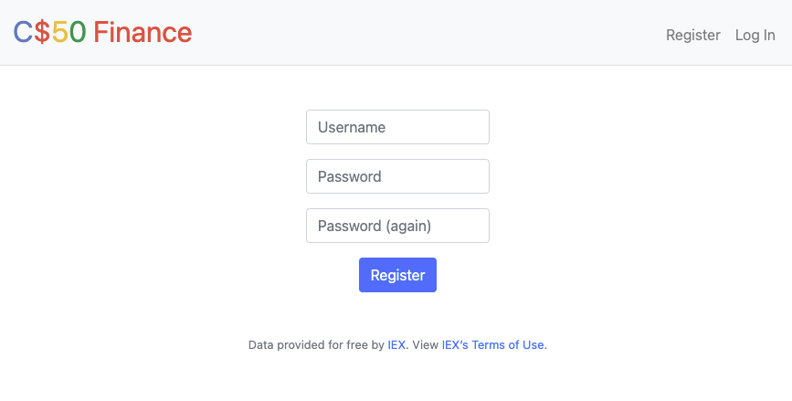
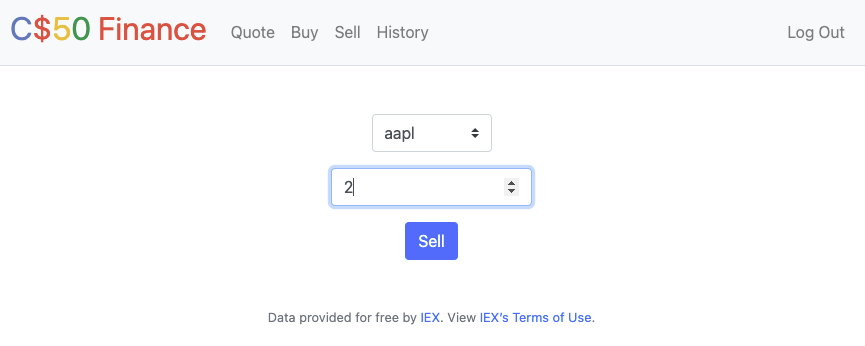

# CS50 - Finance

A web app that allows a user to manage portfolios of stocks. This app checks real stocks' actual prices and portfolios' values, it will also let you buy and sell stocks by querying IEX for stocks' prices.

## Tech stack

- Python
- Flask
- SQLite

## Features

### Register

- Require that a user input a `username`. There will have a message pops up if the user’s input is blank or the username already exists.
- Require that a user input a `password`, and then that same `password again`. There will have a message pops up if either input is blank or the passwords do not match.



- Once the user is registered, the user could be able to `login`.


### Quote

- `Quote` allows a user to look up a stock’s current price.


### Buy

- `Buy` allows a user to buy more shares of a stock that he or she like.
- This requires a user to input a stock’s symbol and a number of shares. There will have a message pops up if the input is not valid or the symbol does not exist.


- When a purchase is complete, the user will be redirected back to the dashboard page.

### Dashboard

- `Dashboard` displays a table summarizing the current the user's purchase or sale


### Sell

- `Sell` enables a user to sell shares of a stock that he or she owns.
- This requires a user to input a stock’s symbol and a number of shares. There will have a message pops up if the user fails to select a stock or if the user does not own any shares of that stock.



### History

- `History` displays a table summarizing all of a user’s transactions ever, listing row by row each and every buy and every sell.

## Todo

- Add a list of all stock names so the user knows what the stock code they need to buy
- Add more front-end to be more reponsive
- Add a function to see the trend of stock price in the last few years
- Add a function to allow users to add additional cash to their account.

## Installation

**Python 3** and **pip** are required to run this project!

## How to run it on your local machine

- Clone this repository to your local
- Create your virtual env by running:

```
python3 -m venv venv
```

- Activate our virtual environment:

```
source venv/bin/activate
```

- Install our dependencies:

```
pip install flask cs50 Flask-Session requests
```

> _When everything is done installing you will see a new `venv` folder that was created._

- Export API key to the virtual environment:

```
export API_KEY=pk_83ddf697a86d4dac80a12f4bbd6c15ab
```

> _This is a free API key from [IEX Cloud API](https://iexcloud.io/docs/api/)._

- Start your server:

```
FLASK_ENV=development flask run
```

> _`FLASK_ENV=development` helps the web app listen to changes. This is optional._

- Open your browser and go to the URL provided, the web app is ready to use now
- Once you have finished working on the project, you can deactivate the virtual environment:

```
deactivate
```
